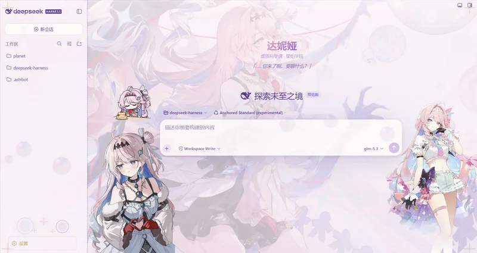
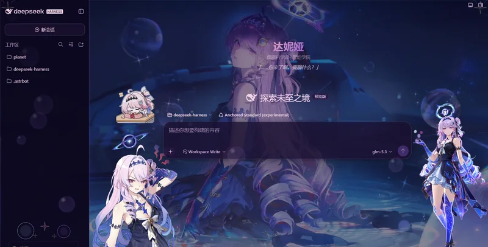

# dsh-client-ui-skin-denia · 达妮娅 · 虚无之泡

DeepSeek Harness Web GUI 的鸣潮达妮娅主题皮肤（独立分发仓库）。

## 效果预览

点击图片可查看完整尺寸。

| 布景之形（亮色） | 幻灭之形（暗色） |
|---|---|
| [](preview/light.webp) | [](preview/dark.webp) |

## 特性

- **双形态切换**：布景之形（亮色）/ 幻灭之形（暗色），含形态切换动画
- **左右全身立绘** + Q版动态 GIF 吉祥物
- **玻璃卡片层级**：root 半透明 + backdrop-filter 模糊
- **泡泡粒子场**：双层虹彩气泡上浮
- **锁链边框**：深紫锁链，跟随侧栏宽度
- **渐变文字**：工作区/会话标题粉紫渐变
- **装饰条 + 四角星**：侧边栏彩虹渐变装饰
- **深色/浅色按钮文字替换**：布景之形 / 幻灭之形
- **新会话欢迎界面注入**：达妮娅标题 + 副标题 + 台词
- **侧栏收起/展开自适应布局**：立绘 + Q版 + 文字居中联动
- **黑白娅分别背景图**

## 版权所有人

| 版权所有人 | 版权所有内容 |
|---|---|
| Kuro Games（库洛游戏） | 「鸣潮」游戏作品及达妮娅（Denia）角色形象原作 |
| Ewnscat | 皮肤覆盖层实现（CSS 配色、SVG 装饰、DOM 装饰逻辑） |

\*背景 / 角色 / 画框素材及预览截图来自用户本地素材库。本皮肤为同人创作，与 Kuro Games 无关联。

## 安装

### 懒人版

对你的 dsh 说：
```
安装一下这个皮肤包：https://github.com/Ewnscat-ya/dsh-client-ui-skin-denia
```

### 手动安装

```sh
git clone https://github.com/Ewnscat-ya/dsh-client-ui-skin-denia
cd <harness>
dsh plugin --profile web add ../dsh-client-ui-skin-denia
```

或手动将本包放入 DSH 的 `profiles/web/node_modules/@dsh-external/dsh-client-ui-skin-denia/` 目录下，然后在 `cordis.patch.yml` 中添加：

```yaml
- id: ui-skin-denia
  disabled: false
```

重启 DSH 后在设置 → 皮肤中选择"达妮娅 · 虚无之泡"。

## 致谢

| 来源 | 说明 |
|---|---|
| [maid-atelier](https://github.com/Small-tailqwq/dsh-deep-whale)（Small-tailqwq） | 皮肤工程结构思路：模块加载工厂模式、内联背景同步、侧边栏伪元素装饰、工作区树标记逻辑、固定层角色舞台架构 |
| [dsh-client-ui-skin-miku](https://github.com/linxin6666)（@linxin6666） | 玻璃卡片层级方式：`[id=root]` backdrop-filter + scrim 遮罩模式 |
| [dsh-web-ui](https://github.com/zhu1090093659/dsh-web-ui)（zhu1090093659） | 皮肤工程脚手架 |


\*反馈问题尽可能在 issue 中发起。

## 许可

本仓库以 **CC BY-NC-SA 4.0**（署名-非商业性使用-相同方式共享）发布，禁止商业性使用。署名链见 `NOTICE`。

Character "Denia" (达妮娅) and "Wuthering Waves" (鸣潮) are trademarks of Kuro Games. This skin is a fan work and is not affiliated with or endorsed by Kuro Games.
