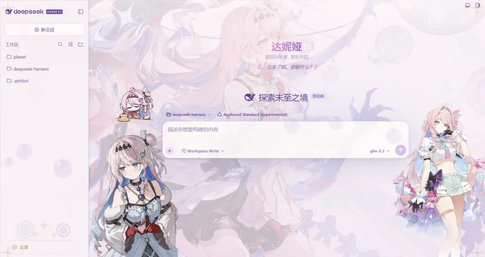
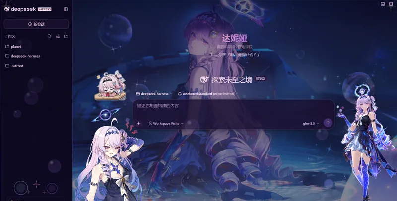

# dsh-client-ui-skin-denia · 达妮娅 · 虚无之泡

DeepSeek Harness Web GUI 的鸣潮达妮娅主题皮肤。

## 效果预览

点击图片可查看完整尺寸。

| 布景之形（亮色） | 幻灭之形（暗色） |
|---|---|
| [](preview/light.webp) | [](preview/dark.webp) |

## 特性

- **双形态切换**：布景之形（亮色）/ 幻灭之形（暗色），含形态切换动画
- **左右全身立绘** + Q版动态 GIF 吉祥物
- **玻璃卡片层级**：root 半透明 + backdrop-filter 模糊
- **泡泡粒子场**：双层虹彩气泡上浮
- **锁链边框**：深紫锁链，跟随侧栏宽度
- **渐变文字**：工作区/会话标题粉紫渐变
- **装饰条 + 四角星**：侧边栏彩虹渐变装饰
- **深色/浅色按钮文字替换**：布景之形 / 幻灭之形
- **新会话欢迎界面注入**：达妮娅标题 + 副标题 + 台词
- **侧栏收起/展开自适应布局**：立绘 + Q版 + 文字居中联动
- **黑白娅分别背景图**

## 版权所有人

| 版权所有人 | 版权所有内容 |
|---|---|
| Kuro Games（库洛游戏） | 「鸣潮」游戏作品及达妮娅（Denia）角色形象原作 |
| Ewnscat | 皮肤覆盖层实现（CSS 配色、SVG 装饰、DOM 装饰逻辑） |

\*背景 / 角色 / 画框素材及预览截图来自用户本地素材库。本皮肤为同人创作，与 Kuro Games 无关联。

## 安装

### 懒人版

对你的 dsh 说：
```
安装一下这个皮肤包：https://github.com/Ewnscat-ya/dsh-client-ui-skin-denia
```

### 手动安装

```sh
git clone https://github.com/Ewnscat-ya/dsh-client-ui-skin-denia
cd <harness>
dsh plugin --profile web add ../dsh-client-ui-skin-denia
```

或手动将本包放入 DSH 的 `profiles/web/node_modules/@dsh-external/dsh-client-ui-skin-denia/` 目录下，然后在 `cordis.patch.yml` 中添加：

```yaml
- id: ui-skin-denia
  disabled: false
```

重启 DSH 后在设置 → 皮肤中选择"达妮娅 · 虚无之泡"。

## 调色板

皮肤加载后，界面右下角会出现一个默认折叠的调色板面板，点击 `🎨` 展开。设置会保存到当前 DSH profile 的皮肤专属文件；刷新、重启、清除浏览器站点存储后仍可恢复。亮色与暗色自定义背景图也会一并保存。

### 亮色 / 暗色（分形态独立控制）

| 控件 | 说明 |
|---|---|
| 背景图 | 上传自定义背景 / 清除恢复默认 |
| 左立绘 | 显示/隐藏左侧角色立绘 |
| 右立绘 | 显示/隐藏右侧角色立绘 |
| Q版吉祥物 | 显示/隐藏 Q版 GIF 表情包 |

### 通用（亮暗两形态同时生效）

| 控件 | 范围 | 默认值 |
|---|---|---|
| 对话宽度 | 500–1000px | 780px |
| 立绘高度 | 30–80vh | 55vh |
| 立绘水平偏移 | −50–50px | 0px |
| 表情大小 | 60–240px | 120px |
| 表情竖直偏移 | −420–300px | 0px |
| 背景透明度 | 20–100% | 100% |
| 消息文本框 | 开/关 | 关 |
| 文本框透明度 | 20–100% | 68% |
| 泡泡粒子场 | 开/关 | 开 |
| 泡泡数量 | 5–40 | 20 |
| 泡泡速度 | 30–200% | 100% |
| 锁链边框 | 开/关 | 开 |
| 装饰条 | 开/关 | 开 |

点击「♻ 恢复默认设置」可一键还原所有选项。

## 兼容性

- DSH Web：0.1.0-rc.6 至 0.1.1-rc.2（dsh-web-frontend）
- DSH 官方桌面端：0.2.0-rc.2（Electron，bundle 方式挂载；v0.0.8 起适配，见更新日志）
- 平台：Web / 桌面端
- 最近验证日期：2026-10-08

## 更新日志

### v1.0.0（热修补充，同版本号）— 2026-10-08

**背景图导入自动压缩 + 比例裁剪 + 窗口化装饰条修复**
- 自定义背景图导入时**自动压缩并按窗口比例居中裁剪**：非 GIF 图片先按当前窗口宽高比居中裁下构图（所见即所得——导入时看到的构图就是背景显示的构图，不受后续窗口大小变化影响），再等比缩放至最长边 1920px 转存 JPEG（质量 0.85，若压缩结果反而更大则保留原图）；解码失败时兜底使用原图
- 源文件上限随之放宽：PNG/JPEG/WebP 提升至 **20MB**（GIF 因需保留动画维持原样存储、不裁剪，上限仍为 5MB）
- 修复窗口化（最大化还原）后顶部装饰条右端提前缩短的问题：过渡动画期间 `geometrychange` 触发时视口宽度与按钮区几何尚未同步（实测写入了 391px 而非 138px），动画结束后无事件再触发导致错误值固化——现在窗口 resize 结束后会重新校正

### v1.0.0 — 2026-10-08

**首个正式版**：桌面端 0.2 适配（corner-shape 圆角根因修复、背景/侧栏/右面板联动、消息框内容门、装饰条贴顶贯通并停靠按钮区）+ Web 版 issue #7 修复 + 调色板设置档案化，功能全集详见下方 v0.0.8–v0.0.17 更新日志。

### v0.0.17 — 2026-10-08

**窗口按钮区物理边界定案（回滚实验性方案）**
- 运行时探针与实测最终确认：桌面端右上角系统按钮区**无法被皮肤着色**——①按钮区是 Electron 原生 Window Controls Overlay（系统合成层，DOM 不可覆盖）；②皮肤服务端插件运行于隔离进程，无法触达主进程的 `setTitleBarOverlay` API（探针实证 `hasBrowserWindow:false`）；③按钮区颜色不跟随页面 `theme-color`（实测）。三个通道全部排除，该区域颜色由官方启动参数写死
- 回滚 v0.0.16 的金色 theme-color 实验值（避免 Web 版浏览器标签栏被染色）与 v0.0.14/15 的 overlay 换色代码；顶部装饰条维持**右端精确停靠按钮区左缘**的最终形态（v0.0.13 机制），这是皮肤能力范围内的最优解

### v0.0.16 — 2026-10-08

**实验：theme-color 联动测试**
- 将系统 chrome 色改为装饰条右端金色，测试桌面端按钮区是否跟随页面 theme-color——实测不跟随，v0.0.17 回滚

### v0.0.15 — 2026-10-08

**窗口按钮区与装饰条视觉贯通（桌面端）**
- overlay 底色从主题深紫改为**装饰条右端同款金色**（--denia-gold），按钮符号改深紫：顶部装饰条延伸进按钮区后颜色无缝衔接，视觉上彩带贯穿整个窗口顶部
- 系统限制保持不变：overlay 只支持纯色（无法在按钮区绘制渐变），且整个按钮列高为按钮底色

### v0.0.14 — 2026-10-08

**实验性：系统窗口按钮区主题化（桌面端）**
- 桌面端右上角最小化/最大化/关闭三键是 Electron 原生 Window Controls Overlay（系统合成层，无法用 CSS 覆盖），但其**背景色与按钮符号色**可以通过主进程 API 运行时修改。皮肤服务端插件现在尝试调用该 API，把按钮区底色对齐当前形态（暗色 = 虚质深紫底 + 达妮娅粉按钮符号；亮色 = 瓷白底 + 深紫符号），并在亮暗形态切换时自动跟随
- 仅当插件宿主与 Electron 主进程同进程时生效；不可达时静默跳过，并在 `~/.dsh/profiles/<档案>/data/dsh-client-ui-skin-denia/electron-probe.json` 写入一次性诊断结果（探针）
- 已知限制：overlay 底色不支持透明，按钮区视觉上是"主题色实底"而非透出背景图

### v0.0.13 — 2026-10-08

**桌面端装饰条收尾**
- 顶部装饰条右端现在**精确停靠在窗口控制按钮区左缘**（运行时取证：桌面端使用 Electron 原生 Window Controls Overlay，最小化/最大化/关闭三键是系统合成层，绘制在一切网页内容之上、任何 z-index 都无法覆盖——按钮区上方物理上不可绘制）。通过 `getTitlebarAreaRect()` 动态计算边界，随窗口按钮区几何变化自动跟随；Web 版无此层，装饰条保持全宽

### v0.0.12 — 2026-10-08

**视觉微调**
- 上下装饰条渐变改为**全幅贯通**：去掉两端 transparent 渐隐端点（原设计两端各留 10% 渐隐，视觉上像左右缺节），现在金→粉→冰蓝→紫→粉→金首尾相接铺满整条

### v0.0.11 — 2026-10-08

**桌面端运行时取证后的根因修复**
- **修复泡泡变方的真正根因**：桌面端 0.2 通过裸 `*` 选择器给全界面元素设置了 `corner-shape: superellipse(1.5)`（新 CSS 圆角形状属性）——它不覆盖 border-radius，而是把一切圆角从正圆扭成"方化圆角"，此前所有针对 border-radius 的加固因此全部无效。皮肤装饰元素（泡泡/立绘/Q 版/锁链/装饰条/调色板）现统一声明 `corner-shape: round` 恢复真圆
- **修复消息流成排"空白细条"**（运行时取证：均为 16px 高的单行思考段，0.2 将每段思考渲染为独立 assistant-step 行）：消息框增加高度门，低于 24px 的单行元素不打框
- 修复 GitHub issue #7（web 0.1.x：左侧立绘与侧栏 Q 版加载后立即变半透明）：`_workbench` 检测改为"可见性 + 完全在屏"双重判定——关闭状态的 workbench 保留盒尺寸，仅凭宽度会误判为打开

### v0.0.10 — 2026-10-08

**桌面端实测反馈修复（第三轮）**
- 修复「消息文本框」把**思考折叠行**框成空白细条的问题（0.2 将每段思考渲染为折叠 `details` 壳，单行 nowrap）：打标时直接排除 details 折叠壳；同时折叠箭头的小 svg 图标不再算作「有内容」（上一版因此放行了思考行）
- 顶部装饰条按反馈**贴回窗口最顶端**（z-index 9000 保持，不再被插件浮层盖出缺口）
- 泡泡粒子：inline 圆角已强制生效的前提下，若仍见「圆角方块」，该元素并非皮肤泡泡（官方 UI 元素）——可用调色板「泡泡粒子场」开关对照确认

### v0.0.9 — 2026-10-08

**桌面端实测反馈修复**
- 泡泡粒子圆角改为 **inline style 强制**（`border-radius:50%` 直接写在元素上）：样式表规则在桌面端被未知来源覆盖导致泡泡呈圆角方形；inline 优先级最高，任何宿主样式表都无法压制
- 修复「消息文本框」把桌面端 0.2 遗留的**空 step 壳**（折叠思考、已完成回合占位）框成空白细条的问题：无文字且无图片/代码块/表格等媒体的消息不再打框，已打框的空壳自动清除
- 右侧面板呼出时，**右立绘现在也随左立绘和 Q 版一起淡出**（0.2 右面板为半透明背景，立绘透出会干扰阅读）
- 修复上下装饰条缺节：z-index 从 100 提升到 9000（压过官方插件浮层的 100–1100），顶部装饰条改为从标题栏下方开始绘制（`--denia-titlebar-height`），不再被窗口控制按钮区域遮挡

### v0.0.8 — 2026-10-08

**桌面端适配与修复**
- 修复官方桌面端（0.2.0-rc.2）下调色板设置写入错误档案的问题：服务端现在读取桌面端实际注入的 `DSH_PROFILE` / `DSH_PROFILE_DIR` 环境变量（原 `DSH_DESKTOP_PROFILE` 在桌面端不存在，导致设置永远落到 web 档案）
- 修复桌面端右侧面板（0.2 更名 rightbar）呼出时左立绘与侧栏 Q 版不淡出的问题；保留旧版本 `_workbench` / `detailsCol` 检测作为兼容兜底
- 修复桌面端收起侧栏时立绘无缩放动作、锁链不隐藏的问题：0.2 把侧栏宽度动画到 0，旧代码将宽度 ≤0 的读数当作无效值丢弃，导致「rail（收起）」状态永远无法设置；现在零宽度读数按收起处理
- 修复桌面端背景图几乎不可见的问题：0.2 桌面端（`html[data-windows-titlebar]`）在布局 frame 上绘制一层不透明底色，盖在 body 背景图之上；皮肤现在将该 frame 底色置透明，停用时恢复原值
- 修复停用皮肤后数秒内装饰「诈尸」的问题：吉祥物与主题按钮文字的一次性重试定时器现在登记在案，停用时全部取消
- 修复主题按钮文字匹配过宽的问题：英文改为整词匹配（`light`/`dark`），不再误伤含 `light` 子串的文字（如 Highlight）；按钮文字变化后自动清除残留标记
- 泡泡粒子 `border-radius:50%` 加固为 `!important`，防止宿主样式表加载顺序变化导致泡泡变方
- 消息文本框打标增加「仅最外层」防御：即使消息流出现嵌套的 assistant-step 行，也只有最外层获得边框，空包裹层不再渲染为空白边框行
- 主 CSS 样式表补充 `data-skin-owner` 标记，停用时随其他装饰一并移除；清理列表补充 `data-denia-bubble-bg`
- 清理死代码：未使用的 `createBgArt`、`swapDelay`、`syncBgArt`

### v0.0.7 — 2026-09-09

**修复**
- 修复 v0.0.6 中用户输入（含生成期间的引导消息）也被套上消息框的问题：「消息文本框」现在**仅作用于 AI 输出**（`assistant-step` 节点），用户侧消息不再打标，并自动清除旧版本残留在用户消息上的标记

### v0.0.6 — 2026-09-08

**修复**
- 修复开启「消息文本框」后设置页 / 插件列表 / 模型列表等卡片被误加消息框装饰的问题（GitHub issue）：消息标记改为双重门控——元素必须位于 `_viewArea` 会话视图内**且**携带 DSH 的 `data-chat-flow-kind` 属性（仅聊天节点具备），同时覆盖 `steering` 类消息；离开会话视图时自动清除残留标记
- 修复皮肤停用 / 重载后 500ms 轮询定时器与 resize 监听不释放的问题（运行期侦测行为不变）
- 修复调整「泡泡数量」时泡泡速度被二次缩放的问题（此前速度设 200% 实际约为 400%）
- 修复「立绘水平偏移」以内联样式覆盖 hero + 收起侧栏定位规则的问题，偏移改走 CSS 变量
- 版本更新提示链接改为 DOM API 生成，不再拼接 innerHTML，并补充 `rel="noopener noreferrer"`

**其他**
- `dsh.client.version` 兼容声明对齐实测范围：0.1.0-rc.6 至 0.1.1-rc.2

### v0.0.5 — 2026-08-24

**新增与改进**
- 调色板默认折叠为 `🎨` 按钮，减少对侧栏空间的占用
- 扩大既有的 Q版达妮娅竖直偏移滑块范围至 −420–300px，便于适配不同窗口高度
- 新增「消息文字配色」开关，可分别应用亮色与暗色形态的更优化消息文字配色规则
- 调色板设置改为保存至 DSH profile 的皮肤专属文件，不再依赖浏览器 origin；滑块、开关及亮色/暗色自定义背景图均可跨刷新、重启和站点存储清理恢复
- 自定义背景上传限制为 PNG、JPEG、WebP、GIF，浏览器端单张文件最大 5MB
- 支持 DSH Web 0.1.0-rc.8

**修复**
- 修正 DevTools 停靠状态检测：启动阶段不再误判为已打开；关闭 DevTools 后左右立绘和侧栏 Q版可靠恢复。保留打开 DevTools 时的淡出效果
- 修正侧栏 footer 的弹性布局；其他插件追加底部内容时，皮肤设置入口不会被挤出可视区域

### v0.0.4 — 2026-08-18

**新增**
- 打开 DevTools 控制台（停靠状态）时，左/右立绘和侧栏 Q版自动淡出至 20% 透明度，关闭后恢复
- 版本检查超时从 5s 增加到 15s，修复代理/VPN 用户因延迟导致更新提示不显示

### v0.0.3 — 2026-08-17

**修复**
- 侧边栏底部区域固定高度导致兼容性 bug：其他插件（如 API 余额显示）向 footer 添加内容时设置按钮被挤出画面。改为 `flex:0 0 auto` 自适应高度，保留 `min-height` 兜底

### v0.0.2 — 2026-08-17

**修复**
- 对话宽度滑块不生效：CSS 选择器改为匹配 DSH Web 真实 DOM（`_centerCol` / `_viewArea` / `_composerSeat`）
- 左侧立绘闪烁：移除 `getComputedStyle()` 强制样式重算，改用 `getBoundingClientRect()` 位置检测
- 刷新后 Q版不出现：添加 2 秒延迟重试，应对 DSH React 异步渲染时序

**新增**
- 右侧 workbench 面板打开时，左立绘和 Q版表情包自动淡出至 20% 透明度，关闭后恢复
- 调色板新增控件：表情大小（60–240px）、表情竖直偏移（−200–200px），亮暗双形态同时生效
- 调色板底部显示当前版本，自动检查 GitHub Release，有新版时提示更新
- README 兼容性声明、package.json `dsh.client.version` 字段

### v0.0.1

- 初始发布

## 致谢

| 来源 | 说明 |
|---|---|
| [maid-atelier](https://github.com/Small-tailqwq/dsh-deep-whale)（Small-tailqwq） | 皮肤工程结构思路：模块加载工厂模式、内联背景同步、侧边栏伪元素装饰、工作区树标记逻辑、固定层角色舞台架构 |
| [dsh-client-ui-skin-miku](https://github.com/linxin6666)（@linxin6666） | 玻璃卡片层级方式：`[id=root]` backdrop-filter + scrim 遮罩模式 |
| [dsh-web-ui](https://github.com/zhu1090093659/dsh-web-ui)（zhu1090093659） | 皮肤工程脚手架 |
| [@frewily](https://github.com/frewily) | 调色板默认折叠与 Q版竖直偏移范围优化 |
| [@1691695205](https://github.com/1691695205) | 消息文字配色开关及亮色/暗色消息配色规则优化 |

\*反馈问题尽可能在 issue 中发起。

## 许可

本仓库以 **CC BY-NC-SA 4.0**（署名-非商业性使用-相同方式共享）发布，禁止商业性使用。署名链见 `NOTICE`。

Character "Denia" (达妮娅) and "Wuthering Waves" (鸣潮) are trademarks of Kuro Games. This skin is a fan work and is not affiliated with or endorsed by Kuro Games.
